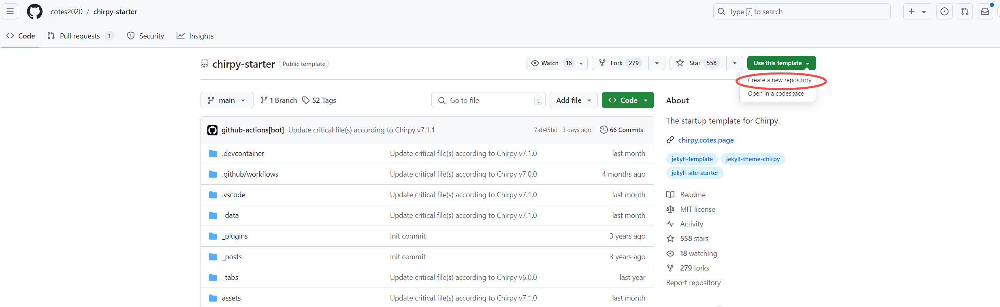
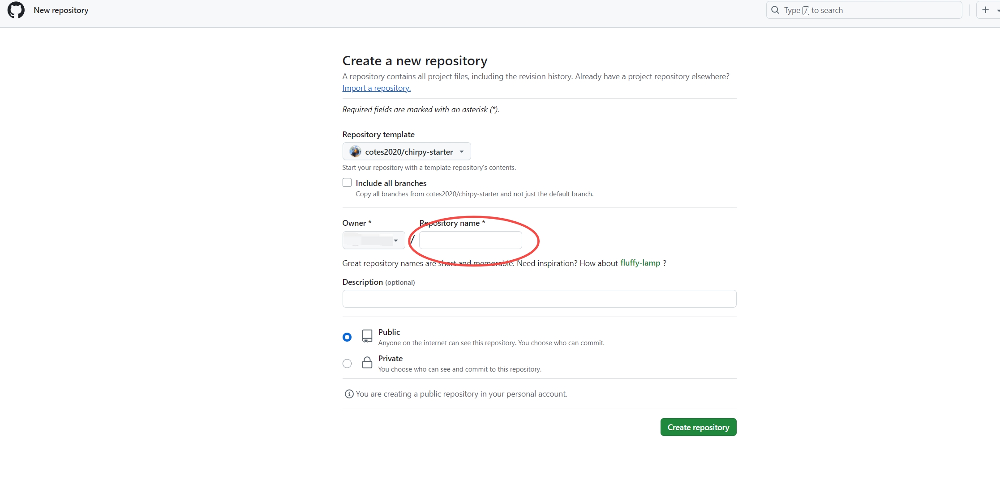
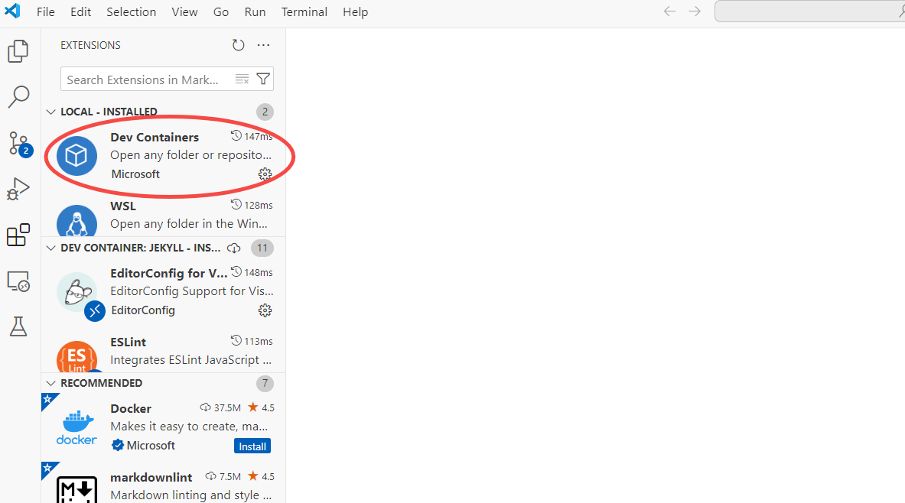
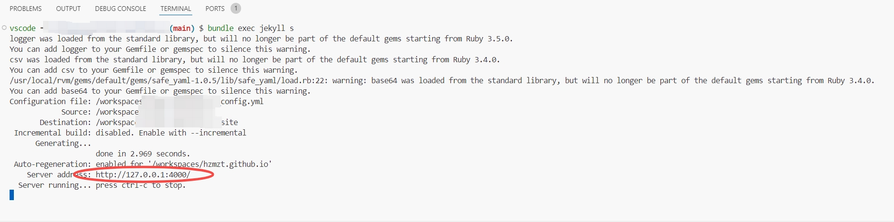

# 创建网站
- 登录[github](https://github.com/) 进入[starter](https://github.com/cotes2020/chirpy-starter)  
- 点击右侧**Use this template**, 选择**Create a new repository**, 填入自己的仓库名称**Repository name**, 例如: xiaonanhai.github.io, 最后点击**Create repository** 就生成了自己仓库 

# 环境设置
- 安装[docker desktop](https://www.docker.com/products/docker-desktop/)
- 安装[vs code](https://code.visualstudio.com/), 安装完成后再进入vs code 安装[Dev Containers扩展](https://marketplace.visualstudio.com/items?itemName=ms-vscode-remote.remote-containers) 
- 把github上的新仓库clone到本地，当clone完后，vs code会提醒**open it in a container**, 确认就可以，然后等待vs code打开完成(该过程比较久，可以点击show log, 看对应的日志)
- 以上操作完成后，就可以在vs code的terminal中执行指令
	- ```$ bundle exec jekyll s```
	- 

# 参考文档
- [chirpy starter](https://chirpy.cotes.page/posts/getting-started/)